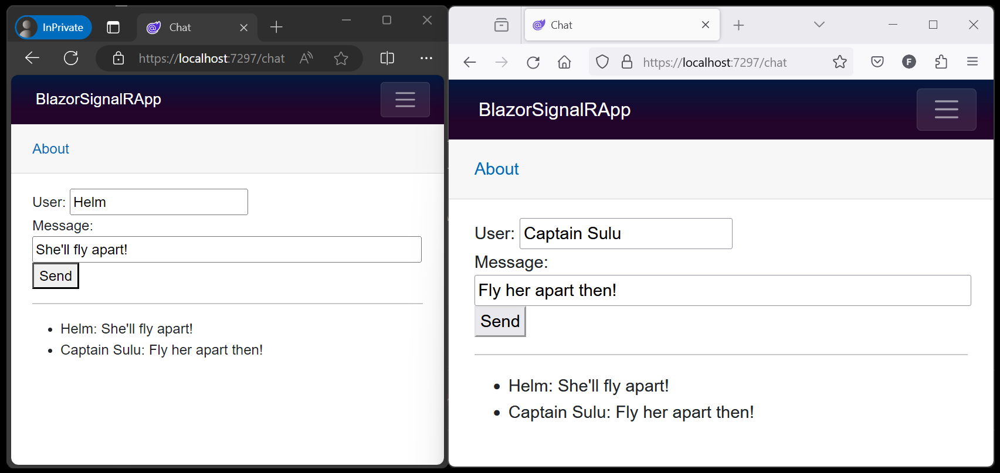

# ⚡ ASP.NET Core SignalR'ı Blazor ile Kullanma

Bu öğretici, SignalR’ı Blazor ile kullanarak gerçek zamanlı bir uygulama oluşturmak için temel bir çalışma deneyimi sunar. Bu makale, SignalR’a zaten aşina olan ve SignalR’ı bir Blazor uygulamasında nasıl kullanacağını anlamak isteyen geliştiriciler için faydalıdır. SignalR ve Blazor çerçeveleri hakkında ayrıntılı rehberlik için aşağıdaki başvuru belgelerine ve API dokümantasyonuna bakın:

* ASP.NET Core SignalR’a Genel Bakış
* ASP.NET Core Blazor
* .NET API tarayıcısı

### Öğrenecekleriniz:

* Bir Blazor uygulaması oluşturma
* SignalR istemci kitaplığını ekleme
* Bir SignalR hub’ı ekleme
* SignalR hizmetleri ve hub uç noktası ekleme
* Sohbet için bir Razor bileşeni kodu ekleme

Bu öğreticinin sonunda, çalışan bir sohbet uygulamasına sahip olacaksınız.

---

## 🧰 Önkoşullar

* Visual Studio
* Visual Studio Code
* .NET CLI
* .NET SDK (en son sürüm)

---

## 🧪 Örnek Uygulama

Öğreticinin örnek sohbet uygulamasını indirmeniz gerekmez. Örnek uygulama, bu öğreticideki adımları izleyerek oluşturulan nihai çalışan uygulamadır. Örnekler deposunu açtığınızda, hedeflemeyi planladığınız sürüm klasörünü açın ve **BlazorSignalRApp** adlı örneği bulun.

**Örnek kodu görüntüle veya indir** (nasıl indirileceği)

---

## 🚀 Blazor Web Uygulaması Oluşturma

Kullandığınız araca göre yönergeleri izleyin:

**Visual Studio**

**Visual Studio Code**

**.NET CLI**

Bir komut kabuğunda:

`cd` komutunu kullanarak proje klasörünü oluşturmak istediğiniz dizine geçin (örneğin:

`cd c:/users/Bernie_Kopell/Documents`).

`dotnet new` komutunu **blazor** proje şablonu ile kullanarak yeni bir Blazor Web App projesi oluşturun.

`-o|--output` seçeneği, geçerli dizin konumunda **BlazorSignalRApp** adlı yeni bir klasör içinde projeyi oluşturur.

`-int|--interactivity` seçeneğini **WebAssembly** ile geçirerek istemci tarafı işleme (CSR) benimseyin.

`-ai|--all-interactive` seçeneğini **False** olarak geçirin.

> **Önemli:**
>
> Projeyi **BlazorSignalRApp** olarak adlandırın (büyük/küçük harf duyarlılığı dahil). Böylece öğreticideki kod örnekleriyle ad alanları (namespace) eşleşir.

```bash
dotnet new blazor -o BlazorSignalRApp -int WebAssembly -ai False
```

Bu makaledeki yönergeler, SignalR istemcisi için bir **WebAssembly** bileşeni kullanır çünkü aynı uygulamadaki Etkileşimli Sunucu bileşeninden bir hub’a SignalR ile bağlanmak mantıklı değildir ve bu durum sunucu bağlantı noktası tükenmesine yol açabilir.

---

## 📦 SignalR İstemci Kitaplığını Ekleme

**Visual Studio**

**Visual Studio Code**

**.NET CLI**

BlazorSignalRApp.Client projesine açık bir komut kabuğunda şu komutu çalıştırın:

```bash
dotnet add package Microsoft.AspNetCore.SignalR.Client
```

Paketi önceki bir sürümle eklemek için, aşağıdaki biçimde sürümü belirtebilirsiniz:

`--version {VERSION}`

---

## 🧩 SignalR Hub’ı Ekleme

Sunucu tarafındaki **BlazorSignalRApp** projesinde **Hubs** (çoğul) adlı bir klasör oluşturun ve aşağıdaki **ChatHub** sınıfını ekleyin:

`Hubs/ChatHub.cs`

```csharp
using Microsoft.AspNetCore.SignalR;

namespace BlazorSignalRApp.Hubs;

public class ChatHub : Hub
{
    public async Task SendMessage(string user, string message)
    {
        await Clients.All.SendAsync("ReceiveMessage", user, message);
    }
}
```

---

## ⚙️ SignalR Hizmetlerini ve Hub Uç Noktasını Ekleme

Sunucu **BlazorSignalRApp** projesinin **Program** dosyasını açın.

Dosyanın en üstüne aşağıdaki ad alanlarını ekleyin:

```csharp
using Microsoft.AspNetCore.ResponseCompression;
using BlazorSignalRApp.Hubs;
```

SignalR ve Yanıt Sıkıştırma (Response Compression) Middleware hizmetlerini ekleyin:

```csharp
builder.Services.AddSignalR();

builder.Services.AddResponseCompression(opts =>
{
   opts.MimeTypes = ResponseCompressionDefaults.MimeTypes.Concat(
       [ "application/octet-stream" ]);
});
```

Yanıt Sıkıştırma Middleware’ini işlem hattının (pipeline) en üstüne ekleyin.

Bu kod satırını `var app = builder.Build();` satırının hemen altına yerleştirin:

```csharp
app.UseResponseCompression();
```

Hub için bir uç nokta ekleyin:

```csharp
app.MapHub<ChatHub>("/chathub");
```


 


# 💬 Sohbet için Razor Bileşen Kodunu Ekleme

**BlazorSignalRApp.Client** projesine aşağıdaki **Pages/Chat.razor** dosyasını ekleyin:

```razor
@page "/chat"
@rendermode InteractiveWebAssembly
@using Microsoft.AspNetCore.SignalR.Client
@inject NavigationManager Navigation
@implements IAsyncDisposable

<PageTitle>Chat</PageTitle>

<div class="form-group">
    <label>
        User:
        <input @bind="userInput" />
    </label>
</div>
<div class="form-group">
    <label>
        Message:
        <input @bind="messageInput" size="50" />
    </label>
</div>
<button @onclick="Send" disabled="@(!IsConnected)">Send</button>

<hr>

<ul id="messagesList">
    @foreach (var message in messages)
    {
        <li>@message</li>
    }
</ul>

@code {
    private HubConnection? hubConnection;
    private List<string> messages = [];
    private string? userInput;
    private string? messageInput;

    protected override async Task OnInitializedAsync()
    {
        hubConnection = new HubConnectionBuilder()
            .WithUrl(Navigation.ToAbsoluteUri("/chathub"))
            .Build();

        hubConnection.On<string, string>("ReceiveMessage", (user, message) =>
        {
            var encodedMsg = $"{user}: {message}";
            messages.Add(encodedMsg);
            InvokeAsync(StateHasChanged);
        });

        await hubConnection.StartAsync();
    }

    private async Task Send()
    {
        if (hubConnection is not null)
        {
            await hubConnection.SendAsync("SendMessage", userInput, messageInput);
        }
    }

    public bool IsConnected =>
        hubConnection?.State == HubConnectionState.Connected;

    public async ValueTask DisposeAsync()
    {
        if (hubConnection is not null)
        {
            await hubConnection.DisposeAsync();
        }
    }
}
```

---

## 🧭 Chat Sayfasına Ulaşmak İçin NavMenu Girişi Ekleme

**Components/Layout/NavMenu.razor** dosyasında, **Weather** bileşeninin `<div>` bloğunun hemen altına aşağıdaki bloğu ekleyin:

```razor
<div class="nav-item px-3">
    <NavLink class="nav-link" href="chat">
        <span class="bi bi-list-nested-nav-menu" aria-hidden="true"></span> Chat
    </NavLink>
</div>
```

---

> ⚠️ **Not:**
>
> Hot Reload kullanırken geliştirme ortamında  **Response Compression Middleware** ’i devre dışı bırakın. Daha fazla bilgi için **ASP.NET Core Blazor SignalR** yönergelerine bakın.

---

## ▶️ Uygulamayı Çalıştırma

Kullandığınız araca göre yönergeleri izleyin:

**Visual Studio**

**Visual Studio Code**

**.NET CLI**

Komut kabuğunda, sunucu tarafındaki **BlazorSignalRApp** projesinin kök klasörüne gidin ve şu komutu çalıştırın:

```bash
dotnet watch
```

Tarayıcıdaki adres çubuğundan URL’yi kopyalayın, başka bir tarayıcı sekmesi veya örneği açın ve adres çubuğuna yapıştırın.

Her iki tarayıcıdan birini seçin, bir ad ve mesaj girin, ardından mesajı göndermek için düğmeye tıklayın.

Ad ve mesaj **her iki sayfada da anında görüntülenecektir.** 


# 🖖 Alıntılar: Star Trek VI: The Undiscovered Country ©1991 Paramount

---

## 🚀 Sonraki Adımlar

Bu öğreticide şunları öğrendiniz:

* Bir Blazor uygulaması oluşturma
* SignalR istemci kitaplığını ekleme
* Bir SignalR hub’ı ekleme
* SignalR hizmetleri ve hub uç noktası ekleme
* Sohbet için bir Razor bileşeni kodu ekleme

SignalR ve Blazor çerçeveleri hakkında ayrıntılı rehberlik için aşağıdaki başvuru belgelerine bakın:
